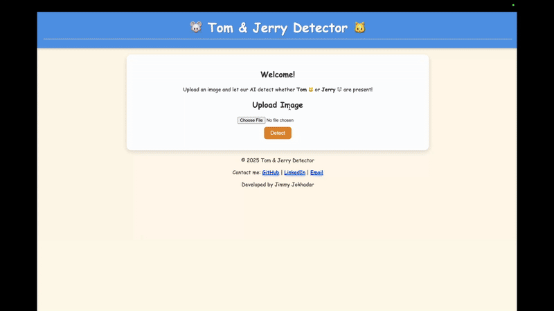

# Tom and Jerry Object Detection – Dockerized Deployment

This project brings the **YOLOv11m-trained Tom & Jerry detector** from a previous project into production using **Flask**, **Docker**, and deployment on **AWS EC2**.  
Upload an image via the web interface, and the app will detect whether **Tom**, **Jerry**, or both appear in the image.  

---

## Features
- Detects **Tom** and **Jerry** in any uploaded image.  
- Simple **Flask web interface** for image upload & detection results.  
- Packaged in **Docker** for easy setup & reproducibility.  
- Deployable on **AWS EC2** (or any cloud/server that supports Docker).  

---

## Setup Instructions

### 1. Clone the Repository
```bash
git clone https://github.com/jimmyjokhadar/tom-jerry-detector.git
cd tom-jerry-detector
```
### 2. Build the docker image
```bash
docker build -t tomjerry-detector .
```
or directly pull from dockerhub
```bash
docker pull jimmyjokhadar/tomandjerry-detector:latest
```

### 3. Run the container
```bash
docker run -p 8000:8000 tomjerry-detector
```

This will start the app at: http://localhost:8000

After opening the app, upload an image and click detect.



## Known Issues / Limitations
- The model is trained on a small dataset (~200 images) → may struggle with unseen poses/scenes.
- Performance may be slower on CPU-only servers.
- Currently limited to Tom and Jerry only (no extra characters).

---
## Demo
You can try it on the following link: https://tjdetector.duckdns.org

---
## License
This project is for educational purposes only. Tom and Jerry characters are copyrighted by Warner Bros.

---
## Contact
For questions or feedback, feel free to reach out.


